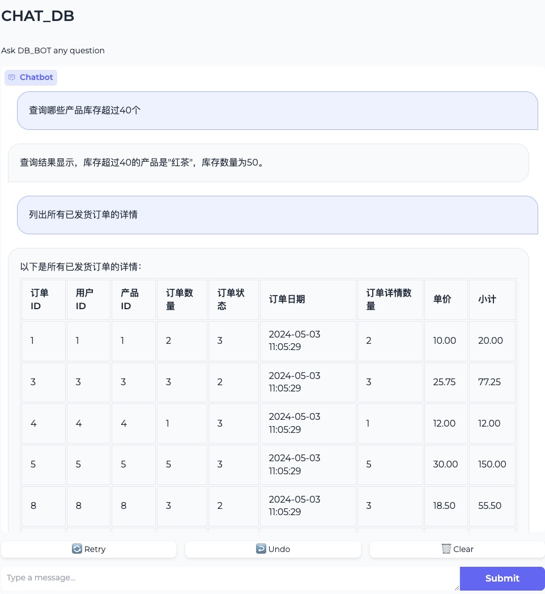
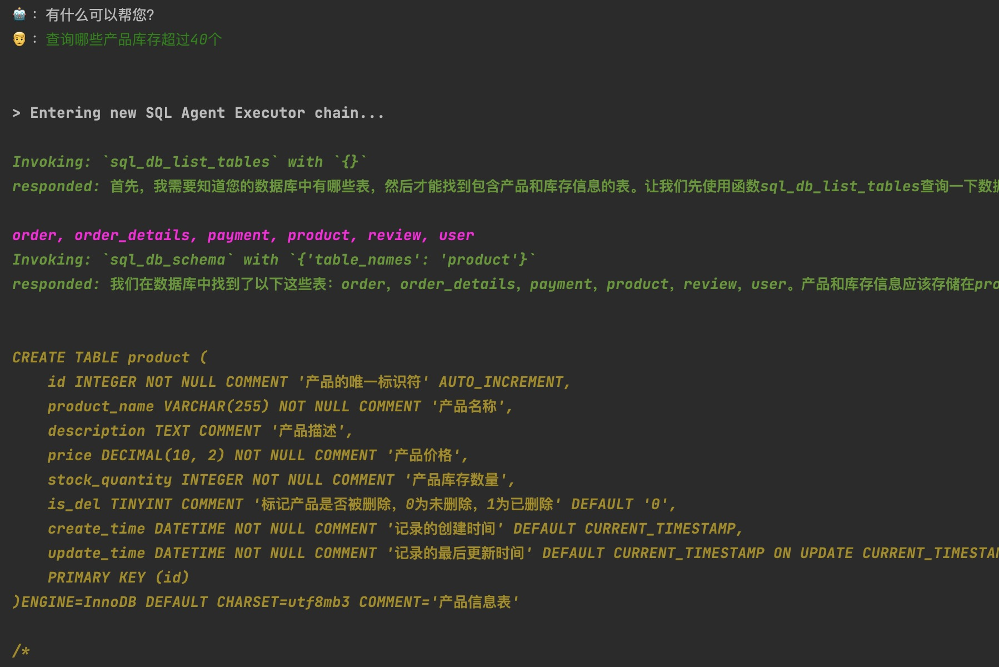
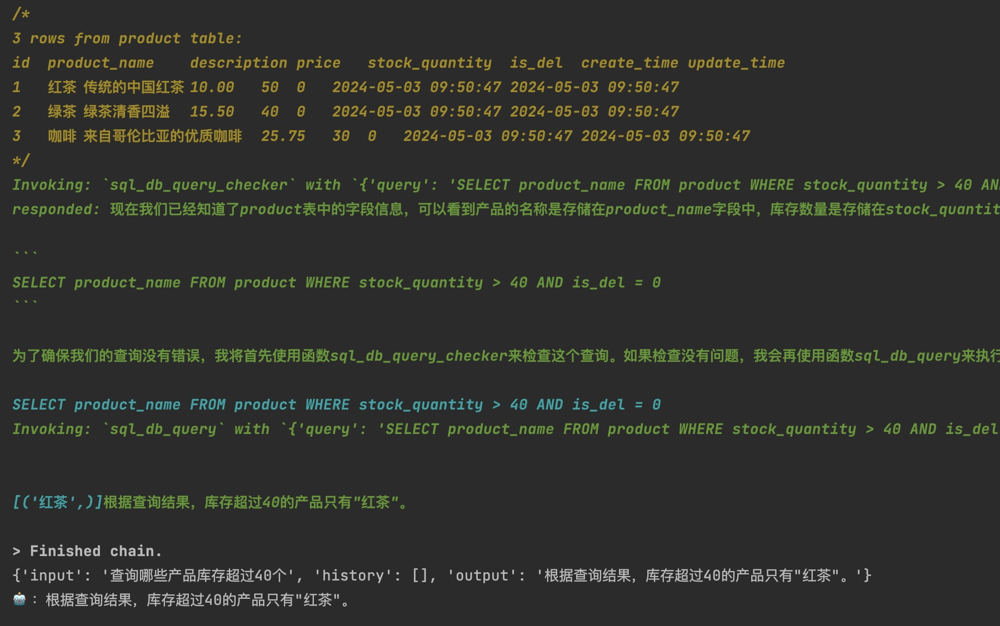

# DB-GPT: Managing databases using natural language, completely changing the traditional web management backend interface


<div align="center">
  <p>
    <a href="https://github.com/sql-agi/DB-GPT">
        
    </a>
    <a href="https://github.com/sql-agi/DB-GPT">
        
    </a>
    <a href="https://opensource.org/licenses/MIT">
      
    </a>
    <a href="https://github.com/sql-agi/DB-GPT/issues">
      
    </a>
  </p>
 👋 加入我们的 <a href="resources/WECHAT.md" target="_blank">WeChat</a>
</div>

## Introduction
🤖 ** DB-GPT is an open-source data application development framework aimed at utilizing Large Language Model (LLM) technology to interact with databases through natural language, 

replacing traditional web management backend. At present, we only have access to query permissions. In order to meet more complex business requirements, including the Create, Read, Update, and Delete (CRUD) functionality, we are currently undergoing internal testing and look forward to bringing more exciting features and optimizations in the future.

🚀🚀🚀 ** In the era of Data 3.0, our products are committed to utilizing model and database technologies to enable businesses and developers to build custom applications with less code. We hope to help you achieve business goals and innovation more efficiently through this approach

## 快速上手
Find a clean directory Then execute the following command
```shell
git clone https://github.com/sql-agi/DB-GPT
cd DB-GPT
conda create --name db-gpt python=3.9
conda activate db-gpt
```
Then switch your environment to db gpt and execute the following command
```shell
pip install -r requirements.txt
```

Configure .env files such as templates .env_tample
The main configuration includes three attributes: OPENAI_API_KEY、OPENAI_API_BASE、MYSQL_URL

### Web & CLi
We provide a method based on [Gradio]（ https://gradio.app ）The web version of the demo and a command-line demo:

#### web demo


Then run [web_demo. py] in the repository:

```shell
python web_demo.py
```

The program will run a web server and output the address. Open the output address in the browser to use it. The latest version of the demo has achieved a typewriter effect, greatly improving the speed experience. Note that due to slow network access in domestic Gradio, when 'demo. queue(). launch (share=True, inbrowser=True)' is enabled, all networks will be forwarded through the Gradio server, resulting in a significant decrease in the typewriter experience. The default startup method has now been changed to 'share=False'. If there is a need for public network access, it can be changed to 'share=True' startup.

#### cli demo




Run in the repository [cli_demo.py] (cli_demo.py):

```shell
python cli_demo.py
```

The program will have an interactive conversation on the command line. Enter instructions and press enter on the command line to generate a reply, and enter 'quit' to terminate the program.

### API Deploy

Run [api.py](api.py)： in the repository:

```shell
python api.py
```
Deployed locally on port 8000 by default, called through POST method

```shell
curl -X POST "http://127.0.0.1:8000/chat/db" \
     -H "Content-Type: application/json" \
     -d '{"input": "你好"}'
```
The obtained return value is

```shell
{
    "reply": "你好！请问有什么可以帮助您的？"
}
```
## 联系我们

### 项目交流群


🎉 Chat_DB 项目微信交流群，如果你也对本项目感兴趣，欢迎加入群聊参与讨论交流。


## 🤗 Reference project
https://github.com/langchain-ai/langchain