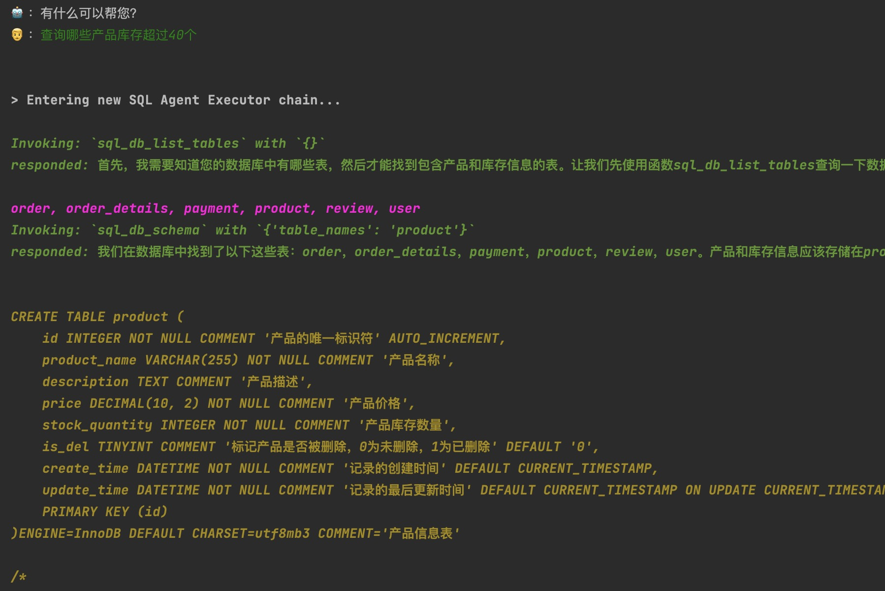

# DB-GPT: Managing databases using natural language, completely changing the traditional web management backend interface

<p align="center">    </p>

<div align="center">
  <p>
    <a href="https://github.com/sql-agi/DB-GPT">
        
    </a>
    <a href="https://github.com/sql-agi/DB-GPT">
        
    </a>
    <a href="https://opensource.org/licenses/MIT">
      
    </a>
     <a href="https://github.com/sql-agi/DB-GPT/releases">
      
    </a>
    <a href="https://github.com/sql-agi/DB-GPT/issues">
      
    </a>
  </p>
 👋 加入我们的 <a href="img/WECHAT.md" target="_blank">WeChat</a>
</div>


## Introduction
🤖 DB-GPT is an open-source data application development framework aimed at utilizing Large Language Model (LLM) technology to interact with databases through natural language, 

replacing traditional web management backend. At present, we only have access to query permissions. In order to meet more complex business requirements, including the Create, Read, Update, and Delete (CRUD) functionality, we are currently undergoing internal testing and we look forward to bringing more surprises to everyone in the future.

🚀🚀🚀 In the era of Data 3.0, our products are committed to utilizing model and database technologies to enable enterprises and developers to build custom applications with less code. Enable developers to focus more on complex C-end business and replace traditional web management backend systems.

## 快速上手
Find a directory where the project is stored, and then execute the following command
```shell
git clone https://github.com/sql-agi/DB-GPT
cd DB-GPT
conda create --name db-gpt python=3.9
conda activate db-gpt
```
Then switch your environment to db gpt and execute the following command
```shell
pip install -r requirements.txt
```

Configure .env files such as templates .env_tample

The main configuration includes three attributes: OPENAI_API_KEY、OPENAI_API_BASE、MYSQL_URL

🔥🔥🔥 I strongly recommend that everyone use the official API_KEY. After testing, some intermediate keys do not support good results

### Web & CLi
We provide a method based on [Gradio]（ https://gradio.app ）The web version of the demo and a command-line demo:

#### web demo


Then run [web_demo.py] in the repository:

```shell
python web_demo.py
```

The program will run a web server and output the address. Open the output address in the browser to use it. The latest version of the demo has achieved a typewriter effect, greatly improving the speed experience. Note that due to slow network access in domestic Gradio, when 'demo. queue(). launch (share=True, inbrowser=True)' is enabled, all networks will be forwarded through the Gradio server, resulting in a significant decrease in the typewriter experience. The default startup method has now been changed to 'share=False'. If there is a need for public network access, it can be changed to 'share=True' startup.

#### cli demo



Run in the repository [cli_demo.py] (cli_demo.py):

```shell
python cli_demo.py
```

The program will have an interactive conversation on the command line. Enter instructions and press enter on the command line to generate a reply, and enter 'quit' to terminate the program.

### API Deploy

Run [api.py](api.py)： in the repository:

```shell
python api.py
```
Deployed locally on port 8000 by default, called through POST method

```shell
curl -X POST "http://127.0.0.1:8000/chat/db" \
     -H "Content-Type: application/json" \
     -d '{"input": "你好"}'
```
The obtained return value is

```shell
{
    "reply": "你好！请问有什么可以帮助您的？"
}
```

## 未来计划
🔥🔥🔥 Front end UI interface：We are committed to developing better front-end UI interfaces, further supporting a wider range of databases and LLMs (including open-source big models), to enhance user experience and system flexibility.

🔥🔥🔥Backend: We will further conduct in-depth testing on more complex CRUD scenarios, adding functions such as distinguishing (switching) environments and setting role permissions to ensure the accuracy and stability of LLM operations.

🔥🔥🔥Summary: We hope to provide more user experience and feedback, and we will further optimize our products based on user feedback. We also hope that interested partners can join our open source team.

## contact us

### Project communication group


🎉 Chat_DB Project WeChat communication group. If you are also interested in this project, please join the group chat to participate in discussions and exchanges.

### 公众号


🎉 Chat_DB The official official account of the project, welcome to scan the code.

## 🤗 Reference project
https://github.com/langchain-ai/langchain